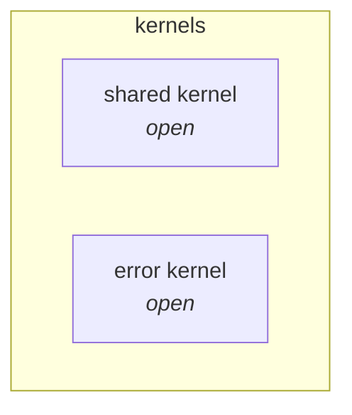

# Context map

Each bounded context is a direct subpackage of `com.example.app` and a Spring Modulith
module. Boundaries are verified by `ModularityTest`, so this document describes intent
while the test enforces it.

## Contexts

| Context | Responsibility | Module type |
|---|---|---|
| `shared` | Shared kernel: types genuinely common to all contexts. | Open — nested packages stay visible. |
| `error` | Error kernel: `DomainException`, `Assert`, the global handler. | Open — nested packages stay visible. |

No business context exists yet. Add the first one and record it here in the same
sentence — a context map written a week later describes what someone remembers rather
than what was built.

## Relationships

Both kernels are the most expensive relationship to maintain, because every context is
coupled to them. Anything that belongs to one context belongs in that context. Adding a
type here should feel like a decision, not a convenience.

## Adding a context

1. Create `com.example.app.<context>` with a `package-info.java` carrying
   `@ApplicationModule`.
2. Add `domain`, `application`, and `infrastructure.{primary,secondary}` beneath it.
3. Expose anything other contexts need from the context's **root** package only.
4. Add its terms to `docs/glossary.md` and its row to the table above.
5. Run `make arch`. A failure here means the boundary is wrong, not the test.
